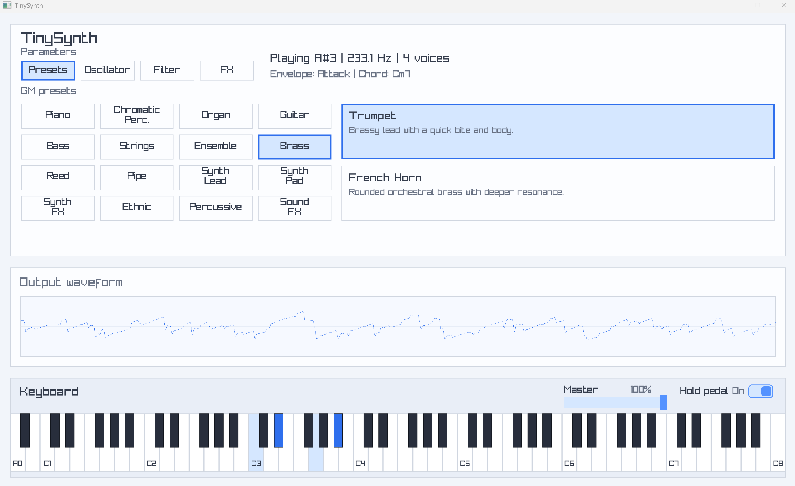
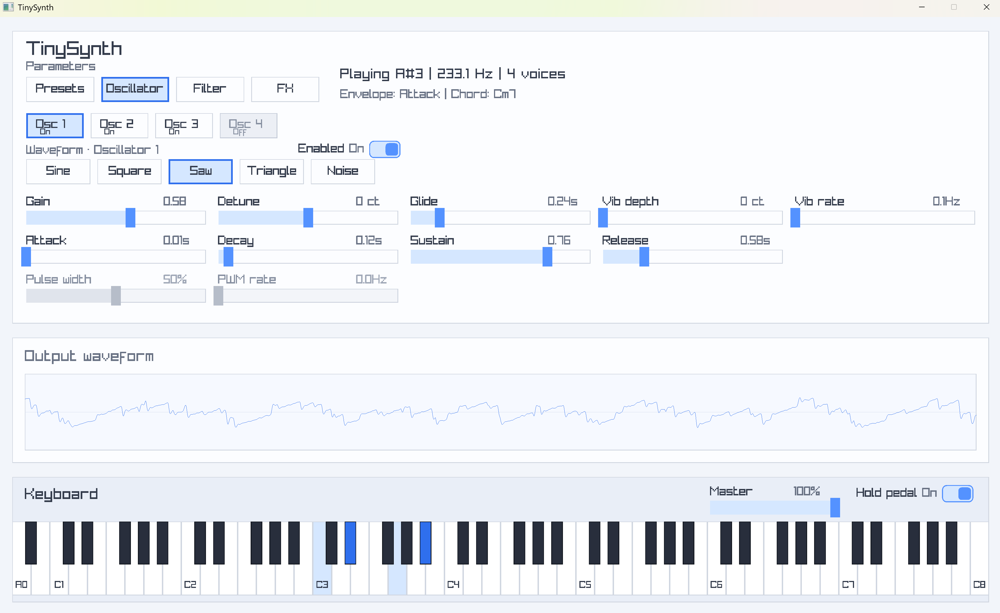
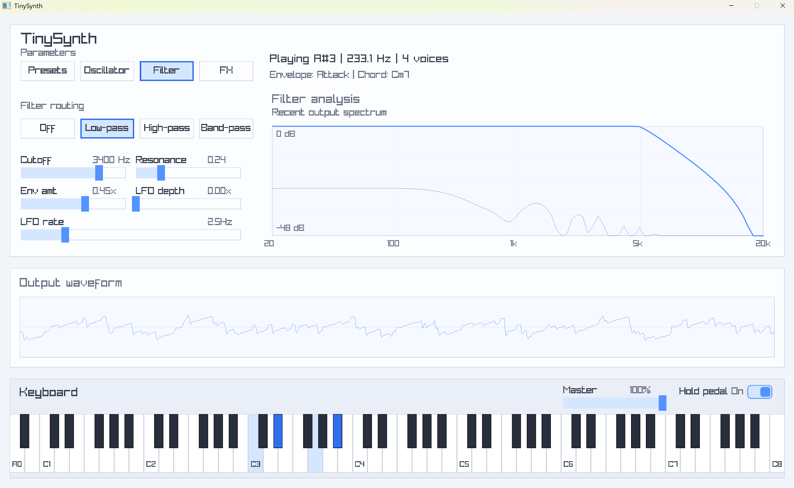
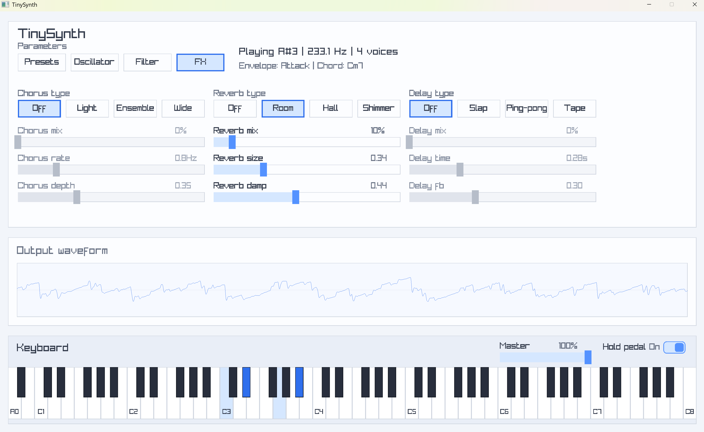

# TinySynth

TinySynth is a small software synthesizer built with .NET 10 and raylib-csharp.

## Features

- 4-oscillator synth engine
- Multiple waveforms, including noise
- PWM support on square waves
- Filter section with modulation
- Chorus, reverb, and delay FX
- GM-inspired preset browser
- Real-time chord detection from active notes
- Full 88-key on-screen keyboard

## Screenshots

Add screenshots here.

### Main UI



### Oscilators Section



### Filter Section



### FX Section



## Getting Started

### Requirements

- .NET 10 SDK
- Windows

### Run

```powershell
dotnet run
```

## Project Structure

- `App/` - application controller and UI flow
- `Synth/` - synth engine, voice logic, parameters, and presets
- `UI/` - layout and rendering helpers

## Notes

<small>

Parts of this codebase were generated with help from GTP-5.4.

</small>
